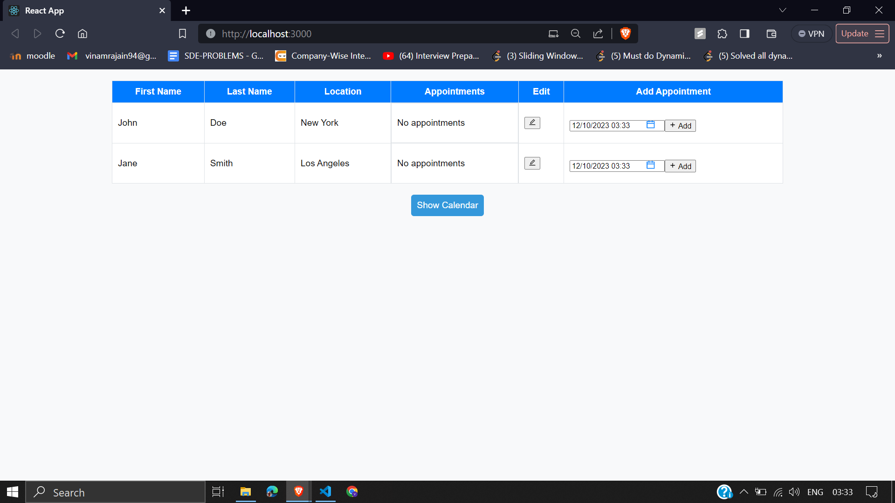

# Fitness Trainer App

The Fitness Trainer App is a web application that allows fitness trainers to manage their clients and appointments easily.

## Table of Contents

- [Prerequisites](#prerequisites)
- [Installation](#installation)
- [Usage](#usage)
- [Features](#features)
- [Screenshots](#screenshots)
  
## Prerequisites

Before you begin, ensure you have met the following requirements:

- Node.js installed on your machine
- Package manager (npm or yarn)
- Backend server (if applicable)

## Installation

1. **Clone the repository:**

   ```bash
   git clone https://github.com/your-username/fitness-trainer-app.git
2. **Navigate to the project directory**
    ```bash
    cd fitness-trainer-app
3. **Install dependencies**

   ```bash
   npm install
## Usage

1. **Start the development server**
   ```bash
   npm start

  The application will be running at http://localhost:3000.
  
2. **Open the web browser and navigate to the provided URL**
3. **Interact with the Fitness Trainer App**

    - View and edit client information.
    - Schedule, edit, and delete appointments.
    - Toggle the calendar to view appointments in a calendar format.
  
## Features
  - Client management: First Name, Last Name, Location, Appointments.
  - Appointment scheduling: Adding Appointments, Editing Appointments, Deleting Appointments.
  - Calendar view: Calendar page for fitness trainers, allowing them to view their scheduled appointments conveniently. 


## Screenshots


*Fitness-Trainer-UI*


*Caption for Screenshot 2*
